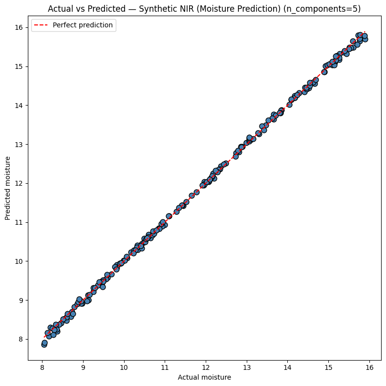

# NIR Pharmaceutical Anomaly Detection System

A self-taught project building a Near Infrared (NIR) spectroscopy-based
pharmaceutical quality control system from scratch.

## Motivation
My father works in the pharmaceutical field and told me about the problem
of fake and adulterated medicines entering the supply chain. I decided to
build a system that could help detect them using the same NIR technology
used in real pharma labs — built entirely from scratch using Python.

## What this system does

Takes a raw NIR spectrum from a pharmaceutical sample and:
1. Cleans and normalises the signal (Savitzky-Golay + SNV preprocessing)
2. Detects anomalies — samples that don't match the reference database
3. Predicts quantitative analyte content (moisture, API, impurity levels)
4. Compares predictions against regulatory limits (ICH Q6A, USP, CFR 21)
5. Issues a PASS or FAIL verdict with full audit trail

## System architecture

Raw NIR scan (512 wavelengths)
        ↓
Savitzky-Golay smoothing (noise removal)
        ↓
SNV normalisation (baseline correction)
        ↓
PCA compression (512 → 2 dimensions, 88.75% variance retained)
        ↓
IsolationForest anomaly detection
        +
PLS regression (quantitative prediction, R² = 0.9993)
        ↓
Regulatory limit check (configurable per analyte)
        ↓
PASS / FAIL verdict + audit log (CSV with timestamp)

## Key results

| Metric | Value |
|---|---|
| PCA variance captured | 88.75% |
| PLS R² (cross-validated) | 0.9993 |
| PLS RMSE | 0.06 units |
| Real-time processing | Yes — one spectrum at a time |
| Anomaly detection accuracy | Validated against 2 independent methods |

## Stages completed

- ✅ Stage 2 — Load, visualise, and understand NIR spectral data
- ✅ Stage 3 — Signal preprocessing (SG smoothing + SNV normalisation)
- ✅ Stage 4 — PCA dimensionality reduction + IsolationForest anomaly detection
- ✅ Stage 5 — Reusable pipeline with robustness testing
- ✅ Stage 6 — Real-time dashboard with live spectrum, peak detection, pause button, CSV logging
- ✅ Stage 7 — Quantitative PLS regression with multi-analyte PASS/FAIL reporting
- 🔄 Stage 8 — Impurity identification (classification) — in progress
- 🔄 Stage 9 — CFR 21 Part 11 compliance layer — in progress
- 🔄 Stage 10 — Predefined rules engine — in progress

## Technologies used

Python, numpy, pandas, scipy, scikit-learn, matplotlib

## Real-time dashboard

## Anomaly detection results

## Quantitative prediction accuracy

## Hardware (pending)

SparkFun AS7265x Triad Spectroscopy Sensor + Arduino Uno.
Software pipeline fully tested and ready.
One line of code changes when hardware arrives.

## Status

Active development — updating as each stage completes.
Built entirely self-taught alongside first year CSE coursework.

## Note on code

Full implementation is maintained in a private repository.
This README summarises the architecture and results.
Contact via LinkedIn for collaboration or discussion.
